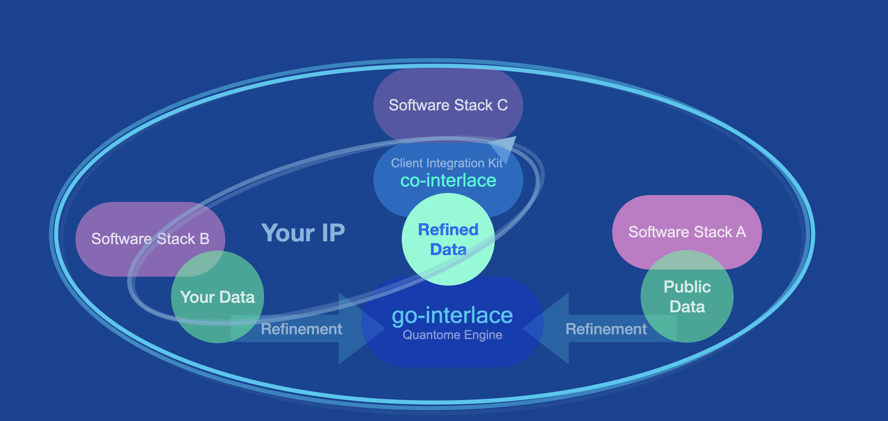
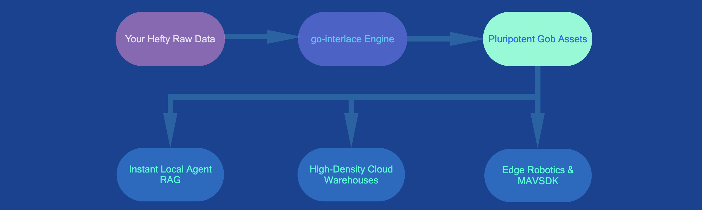

# QUANTOME, SAS.

## The Data Refinery for Enterprise AI.

**We transform hefty data sludge into ultra-refined, deterministic Gob digital assets. Zero friction. Zero cloud vendor lock-in.**

[ **Request Architectural Review** ](https://www.sas-quantome.com)      [ **Explore Public SDK on GitHub** ](https://github.com/sas-quantome/co-interlace)

## The Enterprise AI Bottleneck: "Data on Hold"

Every modern organization is sitting on terabytes of high-value data idling in storage. Whether it is multi-omics DNA sequencing files in a genetics lab, massive system logs, or sprawling historical business catalogs, your data remains paralyzed by three fundamental traps:

* **1. Infrastructure Overload:** Setting up databases and maintaining rigid SQL schemas is heavy, painfully slow, and demands continuous, expensive migration overhead.
* **2. Data Gravity:** Raw unstructured files are too massive to transfer efficiently, compute locally, or push to edge devices. Legacy ERP vendors intentionally trap your data behind exorbitant change-management costs.
* **3. The AI Agent Gap:** Large Language Models (LLMs) and autonomous agents cannot reason over raw, multi-gigabyte flat files. Feeding raw text into model context windows is financially prohibitive and slow.

## Reprogram Your Infrastructure to a "Clean-Slate" Pluripotent State

Quantome resolves this bottleneck with **Interlace**, a lightweight, zero-dependency Go engine that runs anywhere. We decouple your information from rigid legacy schemas, converting raw files into song-sized, structured binary assets that act as your permanent primary storage layer.

Treat massive cloud vendor platforms as disposable secondary indexes. Own your source of truth.

## Engineered for Fierce Byte Condensation

We don't just compress data; we fundamentally refine its mathematical topology using parallel columnar serialization and FNV-1a 64-bit hashing.

In our standard **`interlace-ex` benchmark**, our engine executed the following distillation on a standard laptop:

| Metric                  | Traditional Uncompressed   | Refined Quantome Asset (Gob)      | Net Impact                |
|-------------------------|----------------------------|-----------------------------------|---------------------------|
| **Storage Footprint**   | 57 GB (61.99 GB Raw)       | **293 MB** (307.2 MB Disk Usage)  | **30X Volume Reduction**  |
| **RAM Loading Speed**   | Minutes (Heavy Parsing)    | **Milliseconds**                  | Direct byte-to-RAM access |
| **Runtime Environment** | Heavy Cloud Cluster        | **<16 GB RAM** (MacBook Pro M1)   | **4 CPU Workers Max**     |
| **Processing Time**     | Hours of pipeline overhead | **5 Minutes, 24 Seconds**         | **100% Deterministic**    |

> *"Direct load of desired columnar data into local RAM guarantees zero Go garbage-collection overhead. Add, remove, or modify columns instantly without writing a single SQL migration."*

## Bridge Probabilistic AI with Deterministic Guardrails

Probabilistic LLM agents act before knowing the consequences—putting enterprise infrastructure at severe operational risk. To deploy AI safely, models require highly refined data, deterministic agency in the loop, and strict governance.

* **Local Tooling for Autonomous Agents:** Because Gob arrays load instantly, you can wrap them in local Go APIs to expose verified facts directly to agents as lightning-fast tools.
* **Hallucination-Free Retrieval:** Guarantee output accuracy. Agents retrieve immutable, mathematically verified relationships directly from local parallel Gob arrays.
* **Slash Token Bills:** Pre-indexed text catalogs and enumerated controlled vocabularies radically shrink context windows, saving tens of thousands in API costs.

## Our Open-Core Architecture

We protect our proprietary refinery computation while giving your engineering team complete, transparent freedom over downstream interoperability.

### `go-interlace` (Proprietary Engine)

The core industrial data refinery. Utilizes advanced Directed Acyclic Graphs (DAGs) and Standard Operating Procedures (SOPs) to orchestrate complex data consolidation. It persistently monitors processes, parses execution logs, prevents redundant billing runs, and automatically halts cluster submission upon detecting critical anomalies.

### `co-interlace` (Open-Source Client Kit)

The official public client integration kit. High-performance shell terminal tools and Go structural schemas designed to decode, search, and pipe your refined Gob primary data streams natively into LLMs, BigQuery, Slurm supercomputers, or Elasticsearch.

## Ready to Turn Your Idle Data Into an Ultra-Condensed Source of Truth?

Stop paying legacy vendors to hold your own data hostage. Let Quantome transform your infrastructure sludge into high-octane AI fuel.

**Quantome, SAS.** *Permanent Primary Storage for the Multi-Modal Future.* [https://www.sas-quantome.com](https://www.sas-quantome.com)  |  Operating globally from France.

###### June 28, 2026: Quantome SAS readme v54
