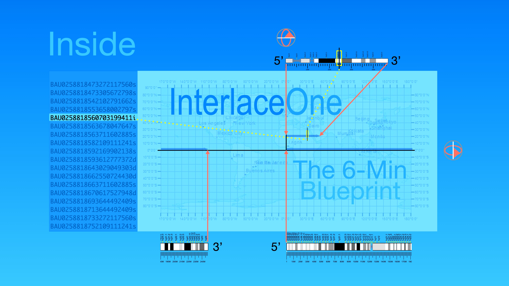
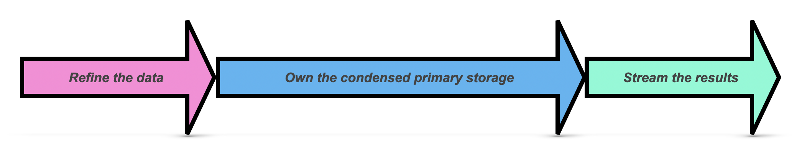

# Quantome SAS

Eliminate data processing friction by transforming raw, massive text files into highly compressed, schemaless, parallel-array Gob data assets. Quantome establishes your permanent **primary storage layer**—making our high-density formats your ultra-condensed source of truth. 

Whether you are working with complex biological datasets, massive system logs, or business catalogs, Quantome’s **Interlace** architecture empowers your IT teams to stream validated data natively into LLMs, search engines, or warehouses. This allows you to treat massive cloud vendor platforms as disposable secondary indexes with absolutely zero vendor lock-in.

### Data on Hold.ᐟ

Every organization has valuable data sitting idle—data on hold. Whether it is sequencing files in a genetics lab, historical logs in an enterprise stack, or content databases waiting to be cataloged, data stays unused because:

1. **Infrastructure Overload**: Setting up databases and maintaining rigid SQL schemas is heavy and slow, and it requires constant migration overhead; or, more likely, there is simply no availability to accomplish the job.
2. **Data Gravity**: Raw files are too large to transfer easily, compute locally, or distribute to edge devices.
3. **The AI Agent Gap**: Large Language Models (LLMs) and autonomous agents cannot reason over raw, multi-gigabyte flat files. Feeding raw text into model contexts is cost-prohibitive (due to token consumption) and slow.

Quantome resolves this bottleneck with **Interlace,** a lightweight, zero-dependency Go engine that runs anywhere and converts  unstructured files into song-sized, structured binary assets.

### Interlace Capabilities

#### 1) Parallel Columnar Serialization
Interlace saves I/O and memory by splitting data into columnar, parallel, Gzip-compressed, primitive-data-type Gob files that are readable on any platform and lightning-fast.
* **Load in Milliseconds**: Direct load of desired columnar data into local RAM with zero garbage-collection overhead.
* **Adapt to Schema Changes**: Add, remove, or modify Gob files (columns) without database migrations or structured schema definitions.

#### 2) Fierce Byte Condensation 
Interlace achieves massive space savings with FNV-1a 64-bit hashing for text catalogs and byte-level enumeration for controlled vocabularies.
* **Up to 29X Compression**: In our interlace-ex benchmark, 9.1 GB of compressed raw data (57 GB uncompressed) is distilled to 311 MB of refined Gob-compressed assets.

#### 3) Deterministic Pipeline Orchestration
Advanced workflows shouldn't rely on manual scheduling or unpredictable software.
* **Deterministic Regulation Loop**: Quantome handles jobs using Interlace's Directed Acyclic Graphs (DAGs) and Standard Operating Procedures (SOPs).
* **Platform Agnostic**: Interlace runs jobs in parallel in local machines, Slurm, or PBS high-performance computing clusters, e.g., supercomputers.
* **Safe Supervision**: Interlace’s deterministic agent persistently monitors processes, parses execution logs, handles errors, prevents redundant runs, and, upon detecting a critical failure, alerts the pipeline to stop submitting further jobs.

### Data Refinement

To build reliable AI applications, LLMs need refined data, human-in-the-loop surveillance, and governance. Quantome helps you bridge the gap between probabilistic AI agents and deterministic data:

* **Token Cost Savings**: Indexed text catalogs and enumerated complex terms reduce context windows and slash API token bills.
* **Hallucination-Free Retrieval**: Verified facts and relationships, ensuring output accuracy, are accessible for agents to retrieve directly from local parallel Gob arrays.
* **Local Tooling for Autonomous Agents**: Because Gob arrays load instantly, you can wrap them in local Go APIs to expose them directly to agents as fast, lightweight tools.

### Our Open-Core System

* **`co-interlace`**: The official open-source client integration kit. High-performance shell tools and Go structural schemas to decode, search, and pipe your refined Gob primary data streams into secondary infrastructure.
* **`interlace-ex`**: Our 311 MB public playground dataset. Download it from our repository releases to experience 29X byte compression and raw terminal query speeds firsthand.

### A View From The Inside

Find out why Go is our core language, what the complexity of storing multi-omics datasets is, and how a human pathogenicity discovery platform comprising trillions of genetic variants was structured.

### ★ Ready to turn your idle data into an ultra-condensed source of truth? 
### ➜ Visit [Quantome SAS](https://www.sas-quantome.com) for our full-service Data Refinery.

###### June 16, 2026: Quantome SAS readme v24
