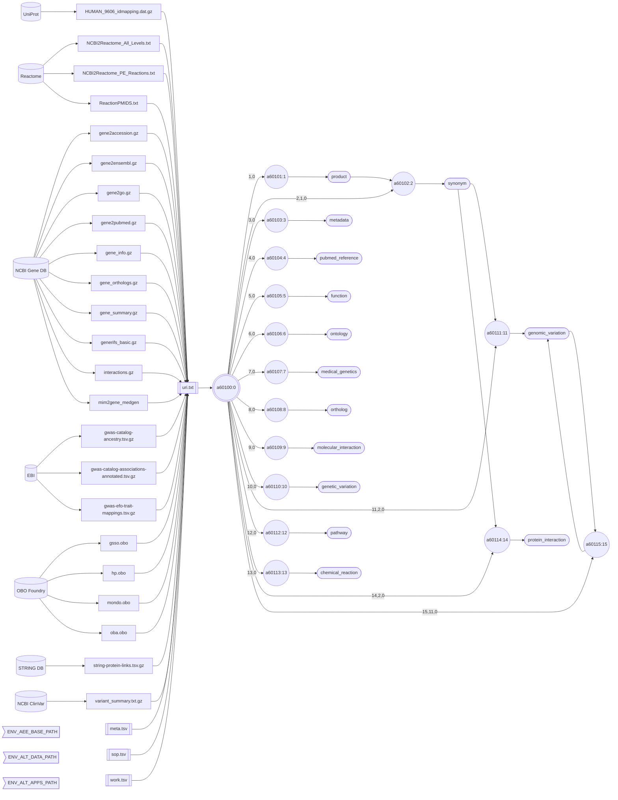

# Quantome, SAS.

Eliminate data processing friction by transforming raw, massive text files into highly compressed, schemaless, purified, parallel-array Gob data assets. Quantome establishes your permanent **primary storage layer**—making our high-density formats your ultra-condensed source of truth. 

Whether you are working with complex biological datasets, massive system logs, or business catalogs, Quantome’s **Interlace** architecture empowers your IT teams to stream validated data natively into LLMs, search engines, or warehouses. This allows you to treat massive cloud vendor platforms as disposable secondary indexes with absolutely zero vendor lock-in.

## Data on Hold.ᐟ

Every organization has valuable data sitting idle—data on hold. Whether it is DNA sequencing files in a genetics lab, historical logs in an enterprise stack, or content databases waiting to be cataloged, data stays unused because:

1. **Infrastructure Overload**: Setting up databases and maintaining rigid SQL schemas is heavy and slow, and it requires constant migration overhead; or, quite likely, there is simply no availability to accomplish the job.
2. **Data Gravity**: Raw files are too large to transfer easily, compute locally, or distribute to edge devices. Traditional Enterprise Resource Planning (ERP) vendors trap an organization's data, preventing AI models from accessing or using it freely. Companies attempting to bolt AI onto legacy ERP systems face stalled projects and exorbitant change-management costs.
3. **The AI Agent Gap**: Large Language Models (LLMs) and autonomous agents cannot reason over raw, multi-gigabyte flat files. Feeding raw text into model contexts is cost-prohibitive (due to token consumption) and slow.

Quantome resolves this bottleneck with **Interlace,** a lightweight, zero-dependency Go engine that runs anywhere and converts  unstructured files into song-sized, structured binary assets. 

Note that LLMs are just one part of AI, and other models are anticipated. For example, LLMs cannot teach you to play music, surf, or master martial arts, yet other models that better understand the physical world, such as the Joint-Embedding Predictive Architecture (JEPA), offer promising prospects. The intelligence space is big. Besides linguistic intelligence, we have logical, spatial, visual, musical, emotional, kinaesthetic, interpersonal, existential, naturalist, and other types of intelligence.

## Quantome's Engine Capabilities

#### 1) Parallel Columnar Serialization
Quantome's Interlace processors are designed to build data products that save I/O and memory by splitting data into columnar, parallel, Gzip-compressed, primitive-data-type Gob files that are readable on any platform and lightning-fast. Thus, a Gob ecoded array of unsigned 8-bit integers guarantees the range 0 to 255.
* **Load in Milliseconds**: Direct load of desired columnar data into local RAM with zero garbage-collection overhead.
* **Adapt to Schema Changes**: Add, remove, or modify Gob files (columns) without database migrations or structured schema definitions.

#### 2) Fierce Byte Condensation 
Quantome's Interlace encoders achieve massive space savings with FNV-1a 64-bit hashing for text catalogs and byte-level enumeration for controlled vocabularies. Each data asset, a collection of Gob-encoded files, can have a text catalog and several enumerators, and a data entity can store one or more data assets.
* **Up to 30X Compression**: In our **`interlace-ex`** benchmark, 8.4 GB of compressed raw data (57 GB uncompressed) is distilled to 293 MB of refined Gob-compressed assets.

#### 3) Deterministic Pipeline Orchestration
Advanced workflows shouldn't rely on manual scheduling or unpredictable software.
* **Deterministic Regulation Loop**: Quantome handles jobs using Interlace's Directed Acyclic Graphs (DAGs) and Standard Operating Procedures (SOPs).
* **Platform Agnostic**: Qunatome's pipeline runs jobs in parallel in local machines, Slurm, or PBS high-performance computing clusters, e.g., supercomputers.
* **Safe Supervision**: Qunatome’s deterministic agent persistently monitors processes, parses execution logs, handles errors, prevents redundant runs, and, upon detecting a critical failure, alerts the pipeline to stop submitting further jobs and wasting money.

#### 4) Lightning-Fast Data Refinement Workflow Engine
The following figures show the performance of our benchmark workflow designed to create the **`interlace-ex`** data stack: 
* **Processed input data, uncompressed:** 61,997,056,000 bytes (57 GB)
* **Downloaded compressed data, disk usage:** 9,068,085,248 bytes (8.4 GB)
* **Refined compressed Gob data, disk usage:** 307,232,768 bytes (293 MB)
* **Gob encoded data tuples:** 54,333,557
* **Volume reduction:** 30X
* **Machine used for this test:** MacBook Pro M1
* **Memory usage:** < 16 GB
* **Max workers allowed:** 4 (consider as CPUs)
* **Input files:** 26
* **Event bash scripts generated by the pipeline:** 15
* **Jobs submitted:** 15
* **Event logs parsed and analyzed:** 15
* **Entity Gob-econded files created:** 91
* **Total data assets created:** 14 (see the dataflow diagram below)
* **Total data entities created:** 1 (Gene)
* **Warnings:** 0
* **Errors:** 0
* **Processing time:** 5 minutes and 24 seconds

## Data Refinement

#### *Because LLM agents are probabilistic and LLMs act before knowing the consequences, this puts your enterprise at risk.*

To improve the reliability of AI applications, LLMs need refined data, deterministic agency in the loop, and governance under human surveillance. Agency is the power to affect the future, both positively and negatively. Your voice matters. Quantome helps you bridge the gap between probabilistic AI agents and deterministic data:

* **Local Tooling for Autonomous Agents**: Because Gob arrays load instantly, you can wrap them in local Go APIs to expose them directly to agents, as fast, lightweight tools.
* **Hallucination-Free Retrieval**: Verified facts and relationships, ensuring output accuracy, are accessible for agents to retrieve directly from local parallel Gob arrays.
* **Token Cost Savings**: Indexed text catalogs and enumerated complex terms reduce context windows and slash API token bills.

## Refinement Workflow Example

A human genes & disease entity workflow is designed to create 14 data assets for the **`interlace-ex`** benchmark. Each data asset in the dataflow diagram below is derived from one or more data sources on the left. The data consolidation and refinement result is shown on the right. The diagram illustrates the flow and transformation relationships between them. Application `a60100` orchestrates the pipeline; it is a deterministic agent that executes tasks according to the planned workflow. Other applications help by building different parts of the data stack.

##### Flowchart Legend

- ⛁ **Cylinders:** External data providers
- ◯ **Circles:** `go-interlace` applications
- 𓉴 **Flags:** Environment variables
- 𓋰 **Ovals:** Data assets containing a least one Gob file
- 𓈙 **Rectangles:** | Raw data files | or || configuration files ||

## Our Open-Core System

* **`co-interlace`**: The official open-source client integration kit. High-performance shell tools and Go structural schemas to decode, search, and pipe your refined Gob primary data streams into secondary infrastructure.
* **`interlace-ex`**: Our 293 MB public playground dataset. Download it from Zenodo Open Source Repositories to experience 30X byte compression in shell terminal query speeds firsthand.

## A View From The Inside

Find out why Go is our core language, what the complexity of storing multi-omics datasets is, and how a human pathogenicity discovery platform worth trillions of genetic variants is capable of retrieving information on any DNA mismatch in the human genome.

### ★ Ready to turn your idle data into an ultra-condensed source of truth? 
### ➜ Visit [Quantome SAS](https://www.sas-quantome.com) for our full-service Data Refinery.

###### June 20, 2026: Quantome SAS readme v51
