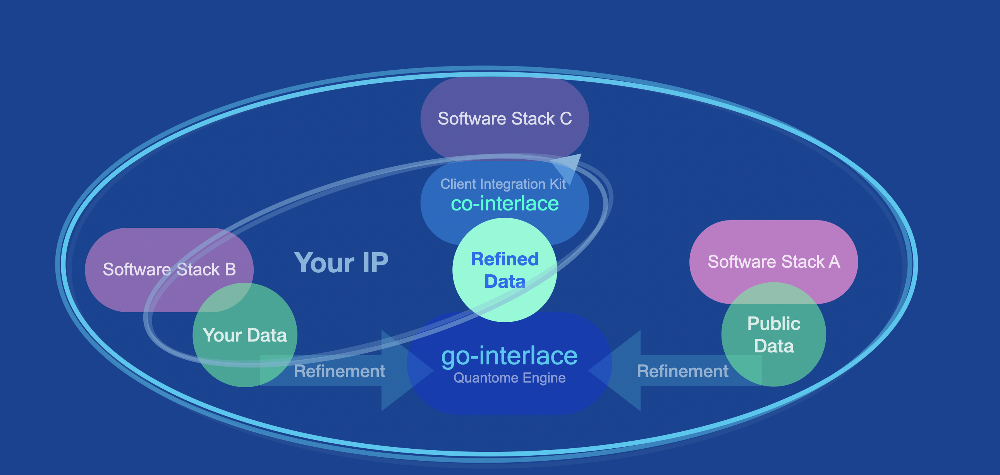

# A New Way of Architecting Data

Data can be governed differently. A database is just a transient tool, and it should be treated as a disposable secondary store. True independence from vendor lock-in requires data products built for additive schema evolution and liberated from archaic standards. By versioning and structuring refined data assets as strongly typed, vertically partitioned parallel arrays, free of infrastructure blotting, Quantome’s **Interlace Architecture** ensures data assets remain vendor-agnostic and strictly validated. The result is immutability and portability, lightweight enough to pipe through simple command-line tools, ready to downstream into transient infrastructures, and clean enough to feed directly into AI models.

## Open-Core Architecture

Quantome offers engineering teams transparent, absolute freedom in downstream interoperability while protecting proprietary data-refinery algorithms. The **Interlace Architecture** is founded in a rigorous producer-consumer paradigm where a refinery engine (e.g., Gob encoder) produces the data assets, and the SDK (e.g., Gob decoder) provides the means to consume the outcome.

### 1. Interlace Engine (*go-interlace*)

The private data refinery orchestrator helps you consolidate complex datasets. It applies advanced Directed Acyclic Graphs (DAGs) and Standard Operating Procedures (SOPs) to enforce deterministic data consolidation. It persistently monitors processes, parses execution logs, prevents redundant billing runs, and automatically halts cluster submission upon detecting critical anomalies.

##### ➜ [ **Request Architectural Review** ](https://github.com/sas-quantome)

Imperatively, while the sophisticated logic of multi-omics synthesis and refinery execution remains the domain of the **Interlace Engine**, the **Interlace SDK** serves as the singular operational interface for the downstream developer community. 

The serialization of datasets into Gob arrays is straightforward. Developers can refactor local workflows to use Gob binary encoding with minimal friction. Due to the architecture’s deterministic simplicity, any asset structured under the **Interlace Architecture** is instantly accessible to the SDK. 

By delivering data exclusively through single-native-type Gob arrays, the framework assures that legacy Python Gob decoders ingest and process these deterministic streams with absolute precision.

### 2. Interlace SDK (*co-interlace*)

The public, high-performance integration SDK and terminal toolkit, is engineered to decode, search, and pipe refined primary data streams natively into local LLMs, supercomputers, edge computing devices, and databases.

* Includes the **interlace Benchmark** dataset and 44 distinct query examples.
* Natively exports query results into Open Knowledge Format (OKF) files—structured data that is both human-readable and optimized for agentic LLM consumption.

Quantome’s **Interlace Architecture** organizes data into immutable versioned data assets. It keeps the footprints of every processing event as proofs of work independent from the **Interlace Engine**, giving you total IP authority.

## Deterministic Data Architecture

Quantome helps resolve this bottleneck with *go-interlace*, a lightweight, zero-dependency Go engine. The engine compiles raw datasets into immutable, Gob song-sized binary assets that serve as a permanent primary storage layer.

This is achieved by strictly improving the mathematical topology of the data through parallel columnar serialization and low-collision non-cryptographic hashing. By separating information from legacy schemas, you can treat cloud platforms as downstream disposable, transient tools and truly own your source of truth.

A common question is why use compiled Go binaries and Gob arrays instead of Python-based tools. The answer is primarily structural. Although Pandas and Polars are excellent for in-memory data exploration, autonomous AI agents or high-performance computing pipelines that process vast amounts of data require immutability, zero-dependency execution, and byte-level RAM efficiency. They are not optimal for autonomous AI orchestration.

| Architectural Vector       | Python / Pandas Ecosystem                             | Interlace Gob Architecture                             |
|----------------------------|-------------------------------------------------------|--------------------------------------------------------|
| **Execution Footprint**    | Requires heavy runtime, e.g., Python, pip, C-bindings | Zero-dependency compiled Go binary                     |
| **Memory Allocation**      | 5x-10x bloat; loads horizontal chunks                 | Strict vertical partitioning; loads exact bytes to RAM |
| **State Mutability**       | Mutable in-memory (High risk of data alteration)      | Immutable, FNV-1a 64-bit hashed (100% Deterministic)   |
| **Pipeline Integration**   | Data trapped within the Python runtime                | Native POSIX compatibility, e.g., cut, sort, sed       |
| **Licensing & Compliance** | High risk of Anaconda commercial fees & SBOM bloat    | Clean Apache-2.0 single static binary                  |

## Benchmark

The architecture guarantees zero Go garbage-collection overhead and loads only the required columnar Gob files directly into local RAM. It permits additive schema evolution, allowing developers to add, remove, or modify columns instantly without writing a single SQL migration.

The **Interlace-ex Benchmark** shows that the **Interlace Engine** executed the following pipeline strictly locally on a standard MacBook Pro M1, under 16 GB RAM, capped at 4 CPU workers:

| Metric                  | Traditional Uncompressed    | Refined Quantome Asset (Gob) | Net Impact                |
|-------------------------|-----------------------------|------------------------------|---------------------------|
| **Storage Footprint**   | 57 GB raw, uncompressed     | 293 MB compressed            | 29X Volume Reduction      |
| **RAM Loading Speed**   | Minutes of heavy parsing    | Milliseconds                 | Direct byte-to-RAM access |
| **Runtime Environment** | Heavy Cloud Cluster         | <16 GB RAM                   | 4 CPU Workers Max         |
| **Processing Time**     | Hours of pipeline overhead  | 5 Minutes, 24 Seconds        | 100% Deterministic        |

## AI Integration

Because the vertically partitioned arrays load in milliseconds, you can wrap them in local Go APIs to expose verified information directly to autonomous agents as lightning-fast tools. Pre-indexed text catalogs and enumerated controlled vocabularies radically shrink context windows, slashing API token bills. Agents retrieve immutable, mathematically verified relationships, thereby guaranteeing hallucination-free retrieval.

## Last Updated

###### August 2, 2026: Quantome SAS readme v80
