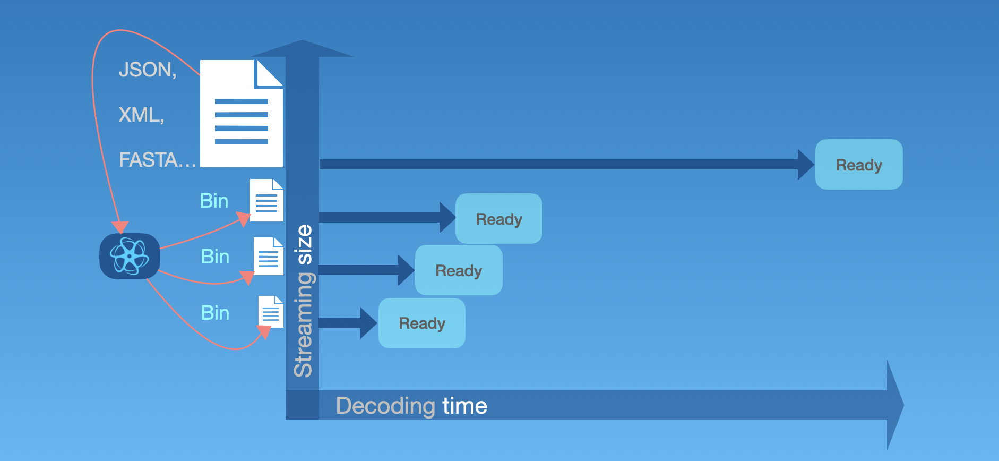

# Welcome to Quantome's Data Refinement Codebase 💎

Quantome is a Paris-based company founded in 2013, dedicated to bioinformatics and data-intensive applications. We govern data soundly by keeping digital assets free from infrastructure bloat, archaic standards, and vendor lock-in. We deterministically transform raw data into curated, version-controlled, downstream application-ready data sets. To demonstrate and uphold these principles, we share our open-source codebase for free and stay committed to keeping it thin.

*Quant + ome = quantitative analysis of biological molecules or entities in an organism.*

###### October 1, 2026: main readme v81
